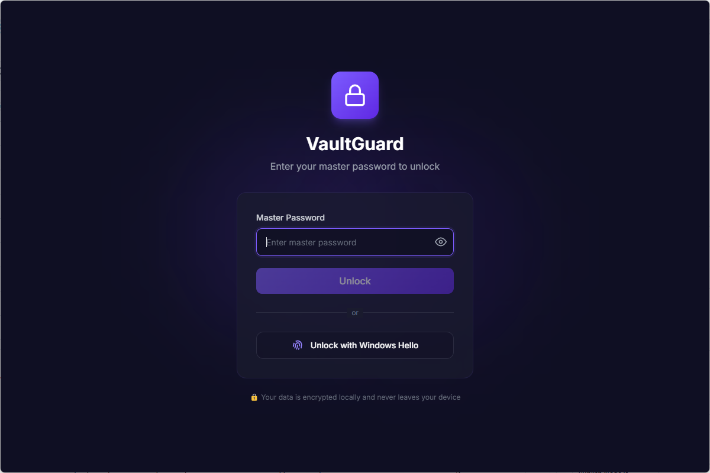
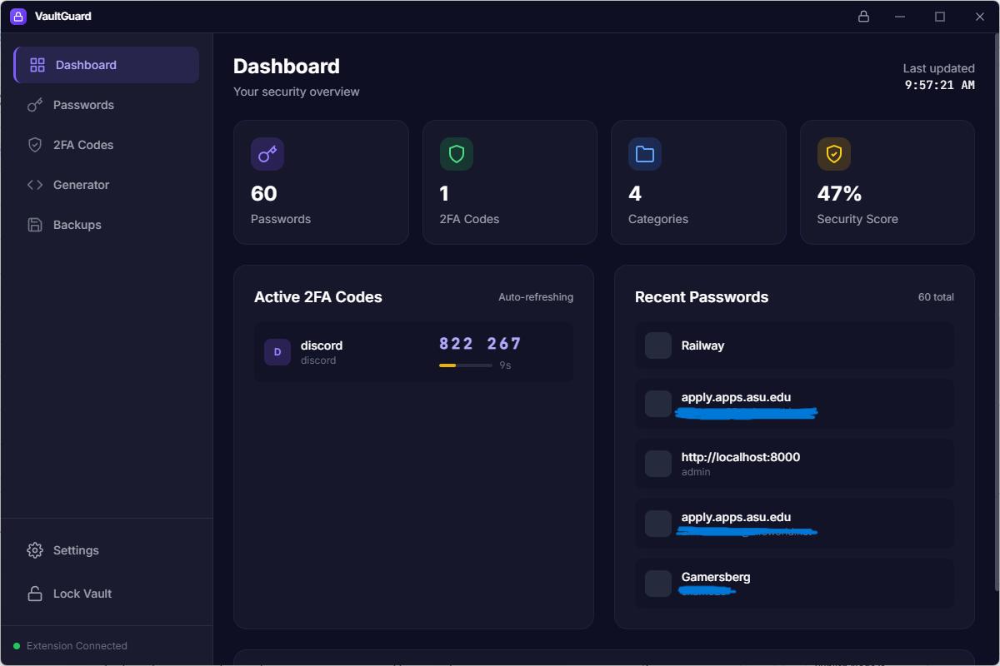
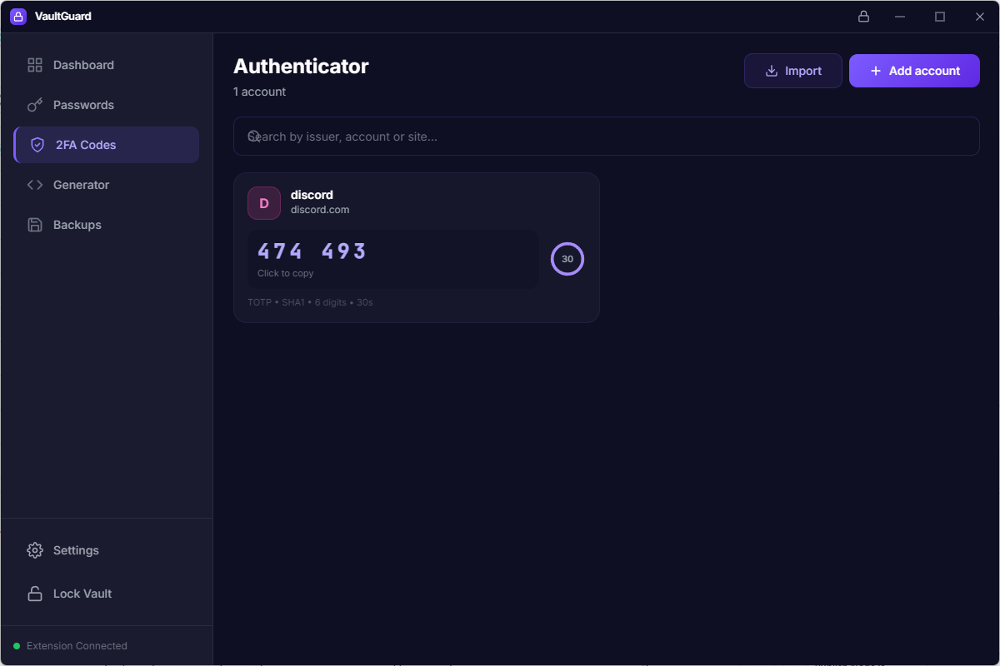
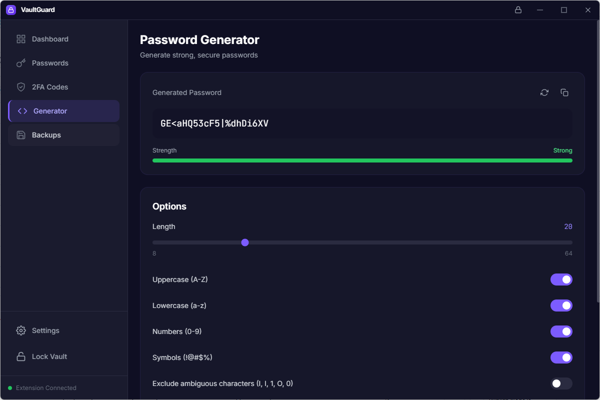
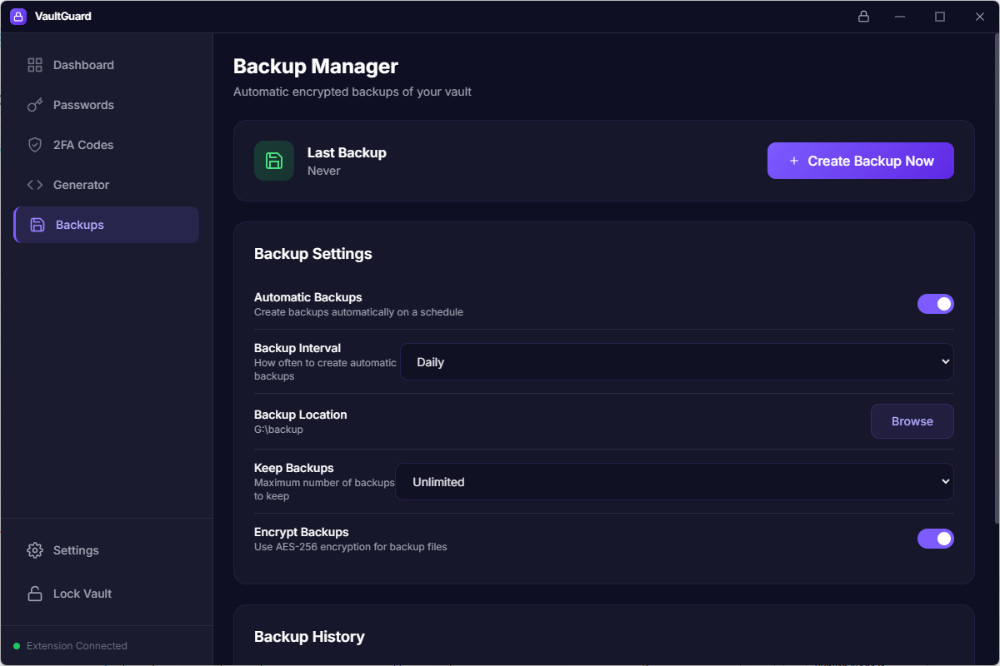
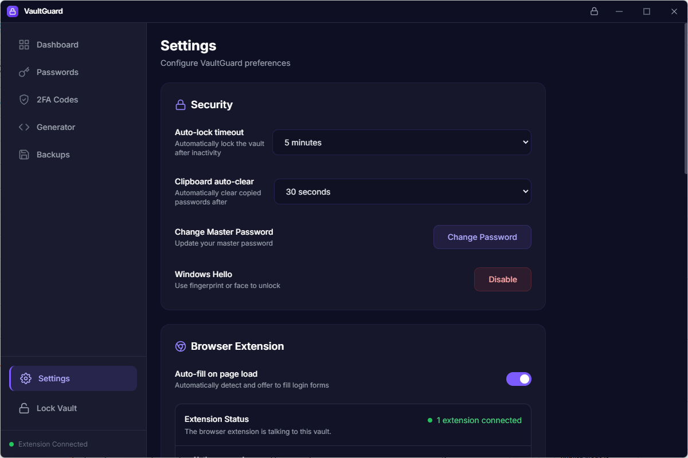
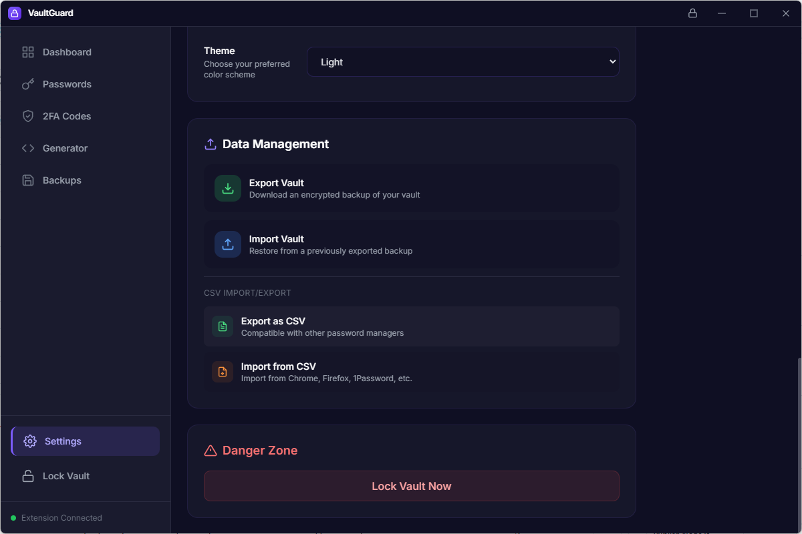

# VaultGuard

**A secure, fully local 2FA & Password Manager with browser extension support — built for the post-password era.**

VaultGuard keeps your passwords, passkeys, and 2FA codes encrypted on your device. No cloud, no tracking, no external dependencies. The desktop app encrypts your vault with AES-256-GCM (PBKDF2, 600k iterations), and the browser extension auto-fills credentials, detects 2FA setup QR codes, and manages WebAuthn passkeys on any webpage.

[](https://opensource.org/licenses/MIT)
[]()
[]()
[]()

---

## Features

| Feature | Description |
|---------|-------------|
| **Password Manager** | Store, organize, and auto-fill credentials per site |
| **2FA / TOTP** | Add codes via QR scan, `otpauth://` URI, or manual secret; auto-refreshing 6-digit codes |
| **Passkey / WebAuthn Manager** | Create, store, and use passkeys (passwordless credentials) — the extension detects `publicKey` requests and signs with your vault-stored passkeys |
| **Auto-fill** | Detects login forms, 2FA fields, and passkey prompts; one-click fill from the extension popup |
| **Windows Hello & Hardware Key Unlock** | Unlock with Face ID / fingerprint / PIN **or** a FIDO2 security key (YubiKey, etc.) — dual-factor vault access |
| **CSV Import/Export** | Compatible with Bitwarden, 1Password, KeePass, Google, and custom formats |
| **Native Messaging** | Extension ↔ Desktop communication over a registered native host (no open ports) |
| **Loopback Bridge Fallback** | Works even when native messaging isn't available |
| **Fully Offline** | Zero network calls; your data never leaves your machine |
| **Duress / Decoy Vault** *(planned)* | Second master password opens a plausible-but-fake vault for coercion scenarios |
| **Local Breach Check** *(planned)* | Offline HaveIBeenPwned k-anonymity check — zero leakage |

---

## What makes VaultGuard unique

Most password managers are cloud-first with local as an afterthought. VaultGuard is **local-first, post-password-era ready**:

- **Passkey-native** — Not just TOTP; the extension creates, stores, and signs with WebAuthn passkeys (Resident Keys) so you can log in passwordless to any site that supports it.
- **Hardware-key vault unlock** — Require a YubiKey / FIDO2 token *plus* (or instead of) your master password. The vault decrypts only when the hardware key is present.
- **Zero vendor lock-in** — Your vault is a single SQLite file. Move it, back it up, sync it with Syncthing/rclone/git — your infrastructure, your rules.
- **Duress mode** — A second "decoy" master password opens a harmless vault; the real one stays cryptographically hidden.
- **Truly offline breach checks** — Download the HIBP prefix database once; check locally with k-anonymity. No passwords ever leave your machine.

---

## Architecture

```
vaultguard/
├── shared/           # Shared TypeScript library (crypto, OTP, CSV, types)
├── extension/        # Chrome MV3 extension (content scripts, popup, background SW, native host)
└── desktop/          # Electron + React + Vite desktop app (Windows NSIS installer)
```

- **shared/** — Pure TS, no Electron/Chrome APIs. Publishes `@vaultguard/shared` locally.
- **extension/** — Manifest V3, service worker background, content scripts for detection/autofill, popup UI. Loads unpacked from `extension/` (no build step).
- **desktop/** — Electron 28, React 18, Vite, Tailwind CSS. Builds a Windows NSIS installer (`VaultGuard Setup 1.0.0.exe`).

---

## Desktop App Screenshots

| | | |
|:---:|:---:|:---:|
|  |  |  |
| *Login / Unlock screen* | *Main vault view* | *Settings panel* |
|  |  |  |
| *Windows Hello biometric setup* | *2FA/TOTP management* | *CSV import/export* |
|  | | |
| *Extension pairing flow* | | |

---

## Extension Screenshots

| | |
|:---:|:---:|
|  |  |
| *Extension popup with credentials & 2FA codes* | *Auto-fill in action on a login page* |

---

## Quick Start — Pre-built Release

### 1. Download

Go to the **[Releases](https://github.com/Sherozabdulghaffar/vaultguard/releases)** page and download the latest `VaultGuard Setup 1.0.0.exe`.

> **Verify** the SHA-256 checksum shown on the release page matches your download.

### 2. Install & First Run

1. Run the installer.
2. **Launch VaultGuard** — on first launch it automatically installs the native messaging host files and registers them with Chrome/Edge/Brave.
3. Create a **master password** (minimum 8 characters).

### 3. Install the Browser Extension

**Chrome / Edge / Brave / Vivaldi / Opera:**

1. Open `chrome://extensions` (or your browser's equivalent).
2. Enable **Developer mode** (top-right toggle).
3. Click **Load unpacked** → select the `extension/` folder from this repo (or the `extension` folder inside the installed app's resources if packaged).
4. Copy the **Extension ID** shown under "VaultGuard".
5. In the installed app, open **Settings → Extension** → paste the Extension ID → **Save**.
6. **Restart the browser** — the extension will now connect to the desktop app.

**Firefox:**

1. Open `about:debugging#/runtime/this-firefox`.
2. Click **Load Temporary Add-on…** → select `extension/manifest.json`.

### 4. Connect

1. Ensure the VaultGuard desktop app is running (unlocked).
2. Click the extension icon → it will auto-pair with the desktop app (a 6-digit code appears in the desktop window; enter it in the extension).
3. You're ready — visit any login page and the extension will offer to fill credentials.

---

## Development Setup

### Prerequisites

- **Node.js 20+** (LTS recommended)
- **pnpm** (or npm/yarn — pnpm is faster for monorepos)
- **Git**
- **Windows 10/11** (for the desktop app; Linux/macOS supported for extension only)

### Clone & Install

```bash
git clone https://github.com/Sherozabdulghaffar/vaultguard.git
cd vaultguard
pnpm install   # or npm install
```

### Build Shared Library (required first)

```bash
pnpm run build:shared
```

### Run Desktop in Dev Mode

```bash
pnpm run dev:desktop
```

This starts:
- Vite dev server at `http://localhost:5173`
- Electron loading from the dev server (hot reload enabled)

### Run Extension in Dev Mode

The extension has no build step — load the `extension/` folder directly as an unpacked extension (see **Quick Start** step 3). Changes to `extension/src/**` are live on browser reload.

---

## Building from Source

### Full Production Build (Windows)

```bash
# 1. Build shared
pnpm run build:shared

# 2. Build desktop installer (outputs to desktop/release/)
cd desktop
npm run build:win
```

The installer will be at `desktop/release/VaultGuard Setup 1.0.0.exe`.

> **Note:** Close any running `VaultGuard.exe` before building, or the installer will fail with "Access is denied" on `d3dcompiler_47.dll`.

### Extension Build

No build needed — the extension runs from source. For production distribution, zip the `extension/` folder (excluding `node_modules/`) and submit to the Chrome Web Store.

---

## Extension Native Messaging Host (Automated)

The extension communicates with the desktop app via a **Native Messaging Host**. The desktop app **automatically handles this on first run** — no manual steps required.

### How it works

1. **First launch** of the desktop app copies the native host files (`vaultguard-native-host.bat`, `vaultguard-native-host.js`, manifest template) to `%APPDATA%\VaultGuard\native-host\`.
2. The app registers a native messaging host manifest in the Windows Registry for Chrome, Edge, Brave, Vivaldi, and Opera — pointing to the bat file.
3. The manifest initially has an empty `allowed_origins` list (no extension installed yet).
4. **After installing the extension**, open **Settings → Extension** in the desktop app, paste the Extension ID, and click **Set Extension ID**.
5. The app updates the manifest with the correct `allowed_origins` and re-registers it.
6. **Restart your browser** — the extension now connects securely.

### Manual fallback (if auto-registration fails)

If the automated registration doesn't work (e.g., permission issues), you can run the included installer:

1. Open `extension/native-host/`
2. Double-click **`install-host.bat`**
3. Paste your Extension ID when prompted
3. The script copies files to `%APPDATA%\VaultGuard\native-host\` and writes Registry keys for Chrome/Edge/Brave
4. **Restart your browser**

### Uninstall

Run `extension/native-host/uninstall-host.bat` to remove Registry entries and files.

---

## Usage

### First Unlock

1. Launch VaultGuard desktop app.
2. Enter your master password → **Unlock**.
3. (Optional) Click **Setup Windows Hello** to enable biometric unlock.

### Adding a 2FA Code

**From the extension popup:**
1. Click the VaultGuard icon → **Add a 2FA code**.
2. **Scan QR on page** — detects QR codes on the current tab.
3. **Paste `otpauth://` URI or secret** — paste the setup key from the service.
4. Fill **Service** (e.g., "GitHub") and **Account** (your username/email).
5. **Save** — the 6-digit code appears and refreshes every 30 seconds.

**From the desktop app:**
1. Open Settings → **Add 2FA**.
2. Same options: scan, paste URI, or manual entry.

### Auto-fill

- **Passwords**: Click a credential in the extension popup → username/password filled on the active tab.
- **2FA codes**: Click a TOTP entry → code copied to clipboard (or auto-filled if a 2FA field is detected).

### Biometric Unlock (Windows Hello)

1. In the extension popup (vault unlocked) → click **Setup Windows Hello**.
2. Approve the Windows Hello prompt.
3. Enter your master password **once** to bind the encryption key.
4. Next time the vault is locked, click **Unlock with Windows Hello** — no password needed.

> **Security note:** The encryption key is stored via Windows DPAPI (Electron `safeStorage`), accessible only by your user account. The WebAuthn credential never leaves the device.

---

## Project Scripts

| Command | Description |
|---------|-------------|
| `pnpm run build:shared` | Compile shared TS library |
| `pnpm run dev:desktop` | Start Electron + Vite dev server |
| `pnpm run build:win` | Build Windows NSIS installer (`desktop/` only) |
| `pnpm run typecheck` | Type-check desktop TypeScript |
| `cd extension && npm run build` | No-op (extension is source-loaded) |

---

## Configuration

| File | Purpose |
|------|---------|
| `desktop/vite.config.ts` | Vite + React + Tailwind config |
| `desktop/package.json` → `build` | NSIS installer options (electron-builder config) |
| `extension/manifest.json` | Chrome MV3 manifest (permissions, content scripts, native host) |
| `shared/tsconfig.json` | Shared library TS config |

---

## Troubleshooting

| Symptom | Likely Cause | Fix |
|---------|--------------|-----|
| Extension shows "Desktop app not running" | Desktop app closed or not started | Launch VaultGuard and unlock |
| "Native host not registered" | Registry keys missing | Open Settings → Extension → click **Set Extension ID** (or run `extension/native-host/install-host.bat`) |
| Installer fails with `d3dcompiler_47.dll` access denied | `VaultGuard.exe` still running | `taskkill /F /IM VaultGuard.exe` then rebuild |
| Auto-fill not working | Extension not connected / content script not injected | Reload extension; check DevTools console for errors |
| Windows Hello unavailable | Not on Windows 10/11, or no biometric hardware | Use master password; Hello is optional |
| "No biometric key stored" after setup | Setup done while vault was locked | Unlock once with master password to bind the key |

---

## Security Model

- **Master password** → PBKDF2 (600k iterations, SHA-256) → 256-bit key
- **Vault encryption** → AES-256-GCM (random 96-bit IV + 128-bit tag per write)
- **Biometric key** → Encrypted with Electron `safeStorage` (DPAPI on Windows) → stored alongside biometric config
- **Session tokens** → 24-hour random tokens, invalidated on lock/quit
- **Transport** → Native Messaging (stdin/stdout) or loopback HTTP (`127.0.0.1:19800-19809`) with per-pair tokens
- **No telemetry, no analytics, no external requests** (except favicon fetching for UI, which can be disabled)

---

## Contributing

1. Fork the repo
2. Create a feature branch: `git checkout -b feature/amazing-thing`
3. Run typecheck: `pnpm run typecheck`
4. Commit with conventional messages: `feat: add amazing thing`
5. Open a Pull Request

**Code style:** TypeScript strict mode, ESLint (extends `airbnb`), Prettier. Run `npm run lint` in `desktop/` before committing.

---

## License

MIT License — see [LICENSE](LICENSE) for details.

---

## Acknowledgments

- [Electron](https://www.electronjs.org/) — cross-platform desktop
- [otplib](https://github.com/yeojz/otplib) — TOTP/HOTP implementation
- [better-sqlite3](https://github.com/WiseLibs/better-sqlite3) — fast embedded SQLite
- [jsQR](https://github.com/cozmo/jsQR) — QR code scanning in the extension
- [Tailwind CSS](https://tailwindcss.com/) — utility-first styling

---

## Support

- **Issues:** [GitHub Issues](https://github.com/Sherozabdulghaffar/vaultguard/issues)
- **Security:** Report vulnerabilities privately via [security@vaultguard.example](mailto:security@vaultguard.example) (or GitHub Security Advisories)

---

> **VaultGuard** — Your passwords, your device, your rules.
